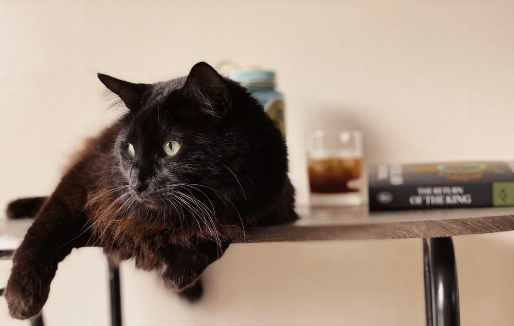
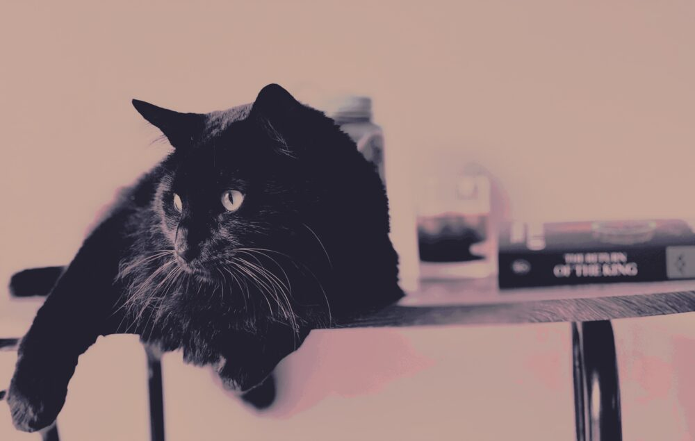
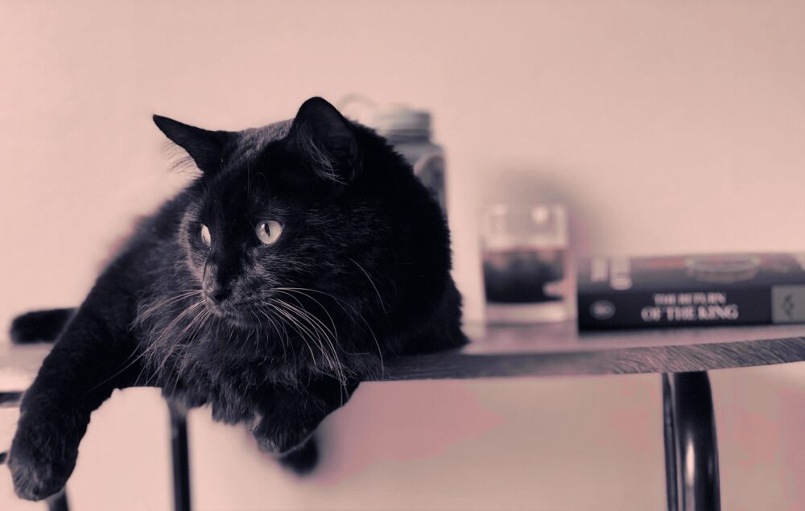
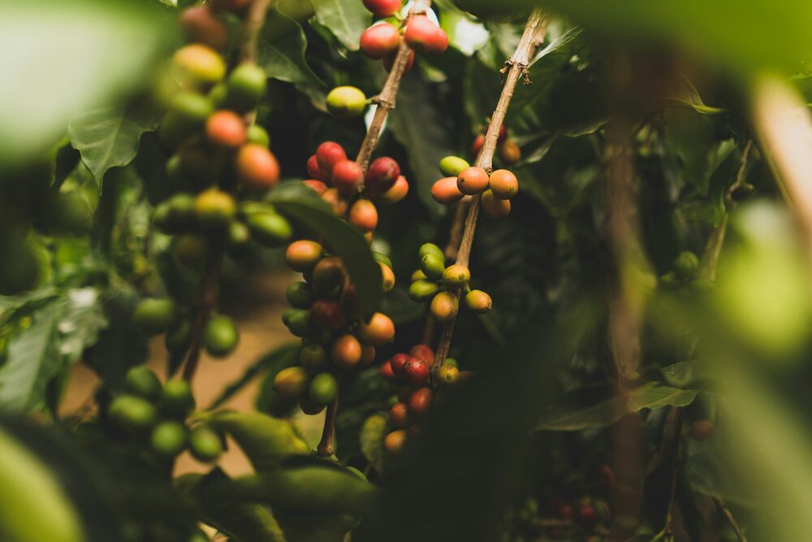
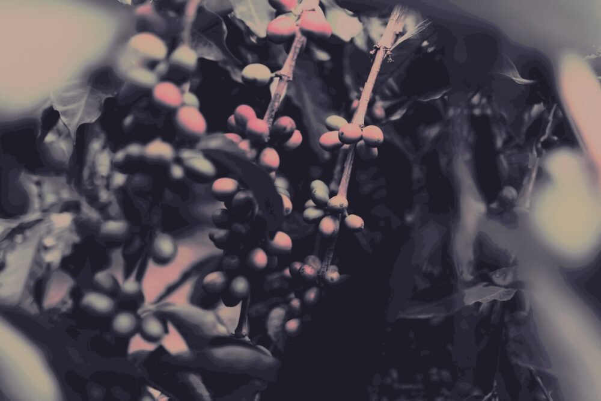
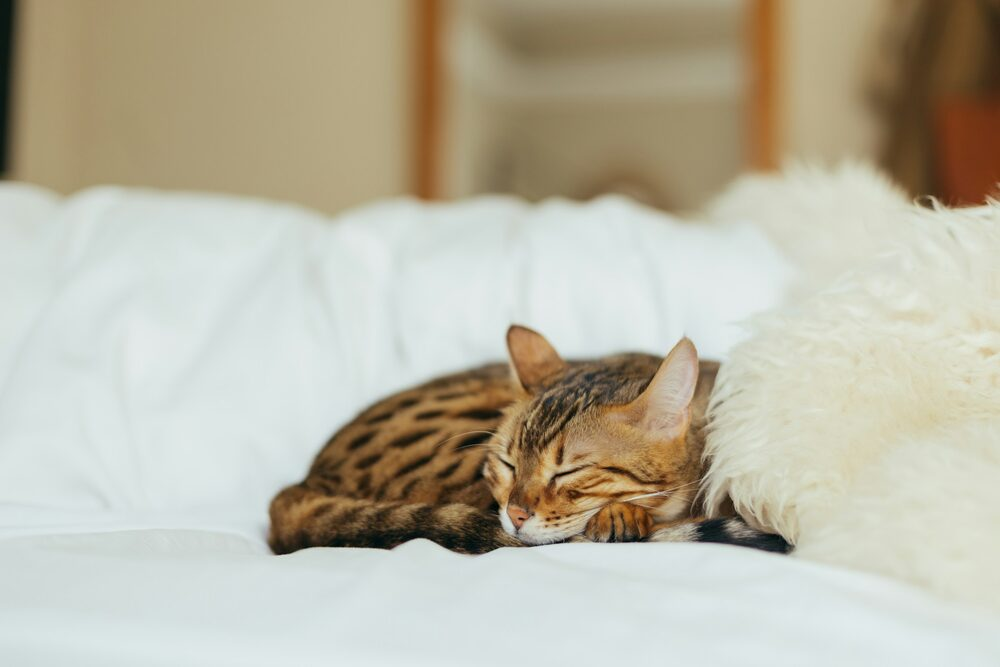
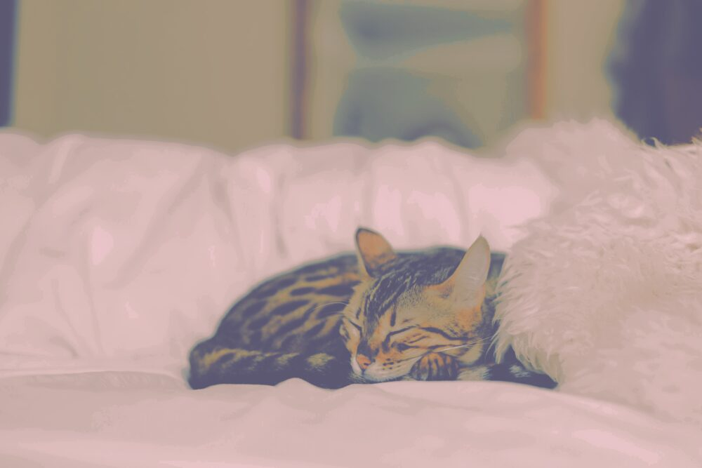

# everwall

Recolor any wallpaper (or any image) into the [Everforest](https://github.com/sainnhe/everforest) palette.

Each pixel is matched to its nearest Everforest colors in the perceptual
**Oklab** color space and blended with Gaussian weights (a radial-basis-function
interpolation — the technique [`lutgen`](https://github.com/ozwaldorf/lutgen-rs)
uses). Blending the nearest few anchors, rather than snapping to one, keeps
smooth gradients smooth instead of banding into flat posterized blocks, while
still pulling the whole image onto the theme.

## Examples

Source photos from [Unsplash](https://unsplash.com), recolored with the commands
shown. All credit to the photographers.

### `dark-medium`

| Original | `everwall cat.jpg` | `everwall cat.jpg -L` |
|---|---|---|
|  |  |  |

Photo by [Madalyn Cox](https://unsplash.com/photos/ZxChxgJa6X0) on Unsplash.
`--preserve-luminance` (right) keeps the original contrast and fine detail,
letting the palette drive only hue and chroma — usually the better choice for
photographs.

### `dark-hard`

| Original | `everwall berries.jpg -p dark-hard` |
|---|---|
|  |  |

Photo by [Clint McKoy](https://unsplash.com/photos/h28p96ICizo) on Unsplash.

### `light-soft`

| Original | `everwall kitten.jpg -p light-soft` |
|---|---|
|  |  |

Photo by [Paul Hanaoka](https://unsplash.com/photos/LcAZcVWsCIo) on Unsplash.

Note that Everforest's dark background ramp is itself near-neutral, so deeply
shadowed regions land on those page tones rather than on a saturated accent.
That is the theme's own character, not a lossy conversion — `--preserve-luminance`
is the knob that keeps such areas legible.

## Setup

This project uses [devenv](https://devenv.sh) + [direnv](https://direnv.net).

```sh
direnv allow      # loads the Rust toolchain automatically on cd
cargo build --release
```

Or without direnv: `devenv shell -- cargo build --release`.

## Usage

```sh
everwall wallpaper.jpg
# -> wallpaper-everforest-dark-medium.png beside the input

everwall wallpaper.jpg -p light-soft -o themed.png
everwall photo.png --preserve-luminance      # keep detail, retheme hue only
everwall --list-palettes
```

### Options

| Flag | Default | Meaning |
|------|---------|---------|
| `-p, --palette` | `dark-medium` | Variant: `{dark,light}-{hard,medium,soft}` |
| `-o, --output` | `<input>-everforest-<palette>.png` | Output path |
| `-n, --nearest` | `8` | Nearest palette colors blended per pixel (`1` = hard snap) |
| `-s, --shape` | `64` | Gaussian falloff — higher = crisper/more posterized, lower = softer |
| `-L, --preserve-luminance` | off | Keep original lightness; palette drives only hue/chroma |
| `-r, --rich` | off | Also anchor to Everforest's muted accent-tinted backgrounds (colored shadows, but a pinker/less-green cast) |

By default the palette is the **neutral** background ramp (bg_dim…bg5) plus the
foreground (fg, seven accents, three greys) — this keeps warm or near-neutral
images reading as green-grey Everforest. `--rich` adds the muted
`bg_visual/red/green/blue/yellow` chrome tints as extra shadow anchors.

### Tuning

- **Photographic wallpapers** — try `--preserve-luminance` to retain fine detail
  and contrast while adopting the theme's colors.
- **Flatter, more "riced" poster look** — lower `--nearest` (e.g. `2`) and/or
  raise `--shape`.
- **Softer, more washed blends** — raise `--nearest` and lower `--shape`.

## How it works

1. Decode the image to RGBA.
2. Convert each pixel to Oklab; palette colors are precomputed in Oklab too.
3. Find the `n` nearest palette colors and blend them with Gaussian weights
   `exp(-shape · d²)`, normalized. Optionally restore the original lightness.
4. Convert back to sRGB and save. The whole pass runs across all cores via
   `rayon`.

## License

MIT
